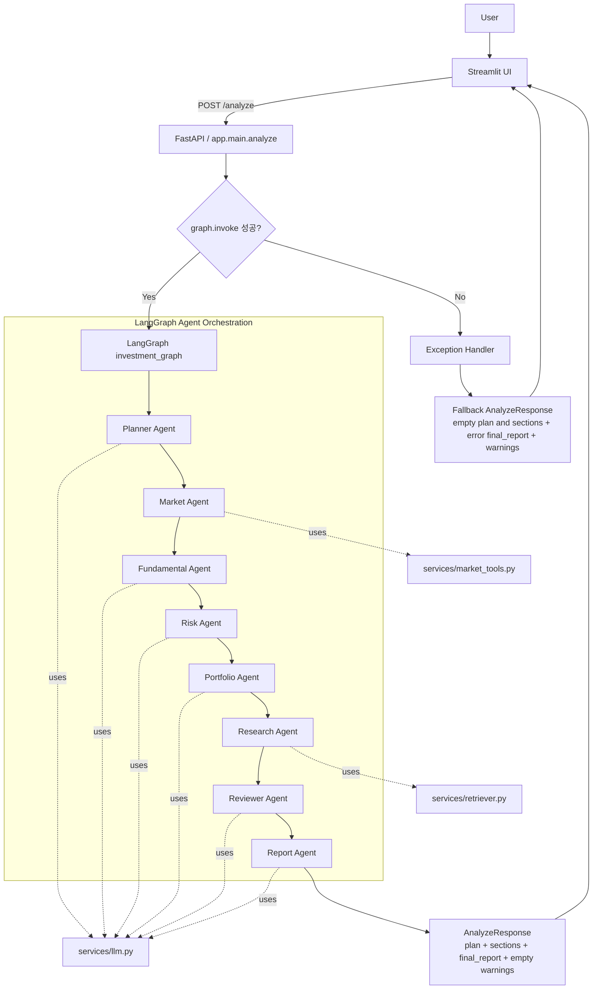
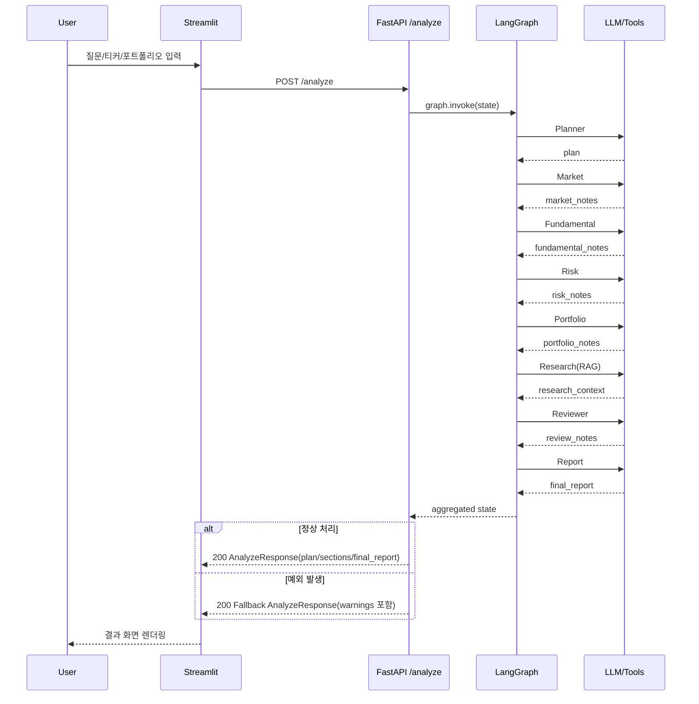

# InvestAI Agent

실무형 투자분석 Copilot 예제입니다. 이 프로젝트는 투자 판단을 자동으로 대신하지 않고,
시장 조사, 뉴스 요약, 포트폴리오 리스크 점검, RAG 기반 근거 제시, 리포트 초안 작성을 수행합니다.

## 핵심 기능
- Multi-Agent 구조 (단일 Agent 아님)
- LangGraph 기반 오케스트레이션
- RAG 기반 내부 리서치 노트 검색
- Structured Output 기반 분석 결과 정리
- MCP/A2A 확장 고려 구조
- FastAPI + Streamlit 패키징

## Agent 구성
- Planner Agent: 사용자 질의를 작업 단위로 분해
- Market Agent: 시장/뉴스/가격 정보 수집
- Fundamental Agent: 재무/실적/밸류에이션 관점 분석
- Risk Agent: 리스크와 반대 시나리오 정리
- Portfolio Agent: 보유 종목과 포트폴리오 영향 평가
- Report Agent: 최종 투자 브리프 작성
- Reviewer Agent: 누락/과장/근거 부족 검토

## 프로젝트 구조
```text
Final/
├── app/
│   ├── agents/
│   │   ├── planner_agent.py
│   │   ├── market_agent.py
│   │   ├── fundamental_agent.py
│   │   ├── risk_agent.py
│   │   ├── portfolio_agent.py
│   │   ├── research_agent.py
│   │   ├── reviewer_agent.py
│   │   └── report_agent.py
│   ├── graphs/
│   │   └── investment_graph.py
│   ├── prompts/
│   │   └── system_prompts.py
│   ├── services/
│   │   ├── llm.py
│   │   ├── market_tools.py
│   │   └── retriever.py
│   ├── config.py
│   ├── main.py
│   └── schemas.py
├── docs/
├── scripts/
│   └── check_aoai.py
├── tests/
├── streamlit_app.py
└── README.md
```

## 프로세스 흐름


### 시퀀스 다이어그램


## 실행
```bash
python -m venv venv
source venv/bin/activate
pip install -r requirements.txt
cp .env.example .env
uvicorn app.main:app --reload
streamlit run streamlit_app.py
```

### Azure OpenAI 연결 점검
```bash
python scripts/check_aoai.py
```

## 주의
- 본 프로젝트는 투자 자문 대행이 아니라 분석 보조 도구 예제입니다.
- 실시간 시세/뉴스 API는 실제 환경에 맞게 교체해야 합니다.
