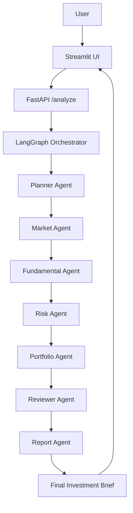

# InvestAI Agent

> LangGraph 기반 Multi-Agent 투자 분석 서비스  
> A LangGraph-based multi-agent investment analysis service

질문과 포트폴리오를 입력하면 시장/재무/리스크/포트폴리오 관점의 분석을 통합해 투자 브리프를 생성합니다.  
Enter a question and portfolio data, and the system generates an investment brief based on market context, fundamentals, risk, and portfolio impact.

---

## 1. Overview | 프로젝트 소개

**InvestAI Agent**는 투자 의사결정 전에 필요한 정보를 구조적으로 정리해주는 **AI 투자분석 Copilot**입니다.  
사용자의 질문과 보유 포트폴리오를 입력받아, 여러 Agent가 역할을 분담해 분석을 수행하고 최종 투자 브리프를 생성합니다.

**InvestAI Agent** is an **AI investment analysis copilot** designed to support structured investment decision-making.  
It takes a user question and portfolio input, then orchestrates multiple agents to generate a final investment brief.

이 프로젝트의 핵심은 단일 챗봇 응답이 아니라, 아래와 같은 **Multi-Agent workflow**를 적용한 점입니다.

**Planner → Market → Fundamental → Risk → Portfolio → Reviewer → Report**

Instead of relying on a single chatbot response, this project uses a **multi-agent workflow** to separate responsibilities and improve structure.

---

## 2. Why I Built This | 기획 배경

투자 분석은 시장 뉴스, 가격 흐름, 재무 상태, 리스크, 포트폴리오 영향 등을 함께 검토해야 합니다.  
하지만 기존 방식은 여러 사이트와 자료를 따로 확인한 뒤 사용자가 직접 종합 판단해야 한다는 한계가 있습니다.

Investment analysis typically requires reviewing multiple dimensions at once:
- market sentiment
- price movement
- company fundamentals
- downside risks
- portfolio impact

기존 방식의 한계는 다음과 같습니다.

- 정보가 여러 곳에 분산되어 있음
- 시장/재무/리스크 관점이 따로 분리되어 있음
- 무엇을 우선적으로 확인해야 할지 판단하기 어려움
- 단순 요약이 아니라 실무형 브리프가 필요함

Traditional workflows require users to gather scattered information manually and combine it into a decision.  
I built this project to reduce that friction and explore how **multi-agent orchestration** can support a more structured decision-support experience.

---

## 3. Key Features | 핵심 기능

- **Multi-Agent 구조**
  - 단일 Agent가 아닌 역할 분리형 분석 구조
- **LangGraph 기반 오케스트레이션**
  - Agent 간 순차적 협업 흐름 설계
- **Structured Output**
  - 분석 결과를 브리프 형태로 정리
- **포트폴리오 입력 지원**
  - 텍스트 입력 + 파일 업로드 지원
- **FastAPI + Streamlit 패키징**
  - 백엔드/프론트엔드 분리형 MVP
- **확장 고려 구조**
  - MCP / A2A / RAG 연동 가능하도록 설계

### In English
- **Multi-agent architecture**
- **LangGraph orchestration**
- **Structured output**
- **Portfolio input support**
- **FastAPI + Streamlit packaging**
- **Extensible design for MCP / A2A / RAG**

---

## 4. Target Users | 대상 사용자

- 개인 투자자
- 투자 리서치 보조가 필요한 실무자
- 포트폴리오 관점까지 함께 보고 싶은 사용자
- LangGraph 기반 Multi-Agent 구조를 참고하려는 개발자

### In English
- Individual investors
- Junior analysts
- Users who want portfolio-aware investment analysis
- Developers exploring LangGraph-based multi-agent systems

---

## 5. Tech Stack | 기술 스택

### Backend
- FastAPI
- Python

### AI / Agent
- LangGraph
- LLM (Azure OpenAI / OpenAI)
- Structured Output

### Frontend
- Streamlit

### Extensibility
- MCP-ready design
- A2A-ready expansion path
- RAG-ready architecture

---

## 6. Agent Architecture | Agent 구성

- **Planner Agent**
  - 사용자 질문을 분석 계획으로 분해
  - Breaks the user query into analysis tasks

- **Market Agent**
  - 시장/뉴스/가격 흐름 분석
  - Reviews market/news/price context

- **Fundamental Agent**
  - 재무/실적/밸류에이션 분석
  - Analyzes financials, earnings, and valuation

- **Risk Agent**
  - 하방 리스크와 반대 시나리오 정리
  - Identifies downside risks and counter-scenarios

- **Portfolio Agent**
  - 보유 종목과 자산 배분 영향 분석
  - Evaluates impact on the user’s portfolio

- **Reviewer Agent**
  - 누락/과장/근거 부족 검토
  - Checks for missing points, overstatements, and weak evidence

- **Report Agent**
  - 최종 투자 브리프 작성
  - Produces the final investment brief

---

## 7. System Flow | 시스템 흐름



---

## 8. Project Structure | 프로젝트 구조

```text
app/
├── agents/
│   ├── planner_agent.py
│   ├── market_agent.py
│   ├── fundamental_agent.py
│   ├── risk_agent.py
│   ├── portfolio_agent.py
│   ├── reviewer_agent.py
│   └── report_agent.py
├── graphs/
│   └── investment_graph.py
├── prompts/
│   └── system_prompts.py
├── services/
│   ├── llm.py
│   └── market_tools.py
├── config.py
├── main.py
└── schemas.py

docs/
scripts/
tests/
streamlit_app.py
README.md
```

---

## 9. Demo Scenario | 사용 예시

예시 질문:
- “삼성전자 지금 추가매수 괜찮을까?”
- “내 포트폴리오 기준으로 특정 종목 비중을 늘려도 될까?”
- “리스크까지 포함해서 투자 브리프를 작성해줘.”

Example prompts:
- “Is this stock worth accumulating now?”
- “How would increasing this position affect my portfolio?”
- “Generate an investment brief including downside risks.”

처리 흐름:
1. 사용자가 질문과 포트폴리오 입력
2. Planner Agent가 분석 계획 수립
3. 각 Specialist Agent가 역할별 분석 수행
4. Reviewer Agent가 결과 검토
5. Report Agent가 최종 투자 브리프 생성

Flow:
1. User enters a question and optional portfolio data
2. Planner Agent builds the analysis plan
3. Specialized agents perform role-based analysis
4. Reviewer Agent checks the outputs
5. Report Agent generates the final investment brief

---

## 10. Quick Start | 빠른 실행

```bash
python3 -m venv .venv
source .venv/bin/activate
python -m pip install -r requirements.txt
python -m uvicorn app.main:app --reload --host 127.0.0.1 --port 8000
python -m streamlit run streamlit_app.py --server.port 8501 --server.headless true
```

- Streamlit: `http://localhost:8501`
- FastAPI: `http://127.0.0.1:8000`

---

## 11. What This Project Demonstrates | 이 프로젝트로 보여주는 역량

- Multi-Agent 서비스 설계 능력
- LangGraph 기반 Agent orchestration 구현
- 역할 기반 Prompt Engineering
- Structured Output 기반 결과 정리
- FastAPI + Streamlit 기반 End-to-End 서비스 구성
- 실서비스를 고려한 확장형 아키텍처 설계

### In English
- Multi-agent service design
- LangGraph-based orchestration
- Role-based prompt engineering
- Structured output design
- End-to-end AI service implementation
- Extensible architecture for future production-grade features

---

## 12. Future Improvements | 향후 확장

- 실시간 시세 API 연동
- 뉴스 API 연동
- 내부 리서치 문서 기반 RAG
- 병렬 Agent 실행
- 사용자 투자 성향 기반 프롬프트 분기
- MCP 기반 외부 시스템 연결
- A2A 기반 동적 Agent 협업

### In English
- Real-time market price API integration
- News API integration
- RAG with internal research documents
- Parallel agent execution
- User risk-profile based prompt branching
- MCP-based external system integration
- A2A-based dynamic agent collaboration

---

## 13. Notes | 참고

- 본 프로젝트는 **투자 자문 대행 서비스가 아닌 분석 보조 도구 예제**입니다.
- 실제 운영 환경에서는 외부 시세/뉴스 API 및 데이터 검증 로직이 추가로 필요합니다.

### In English
- This project is a **decision-support prototype**, not a financial advisory service.
- Real-world deployment would require external data validation and live market/news integrations.
