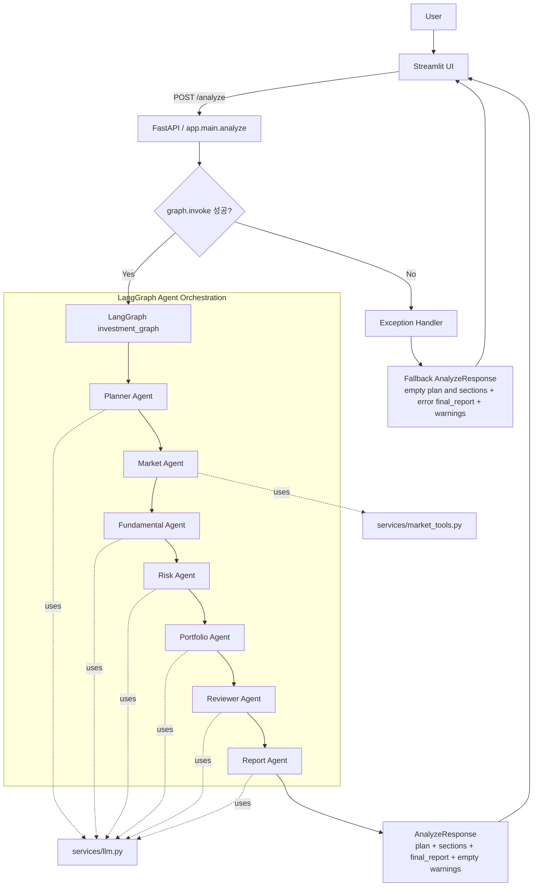
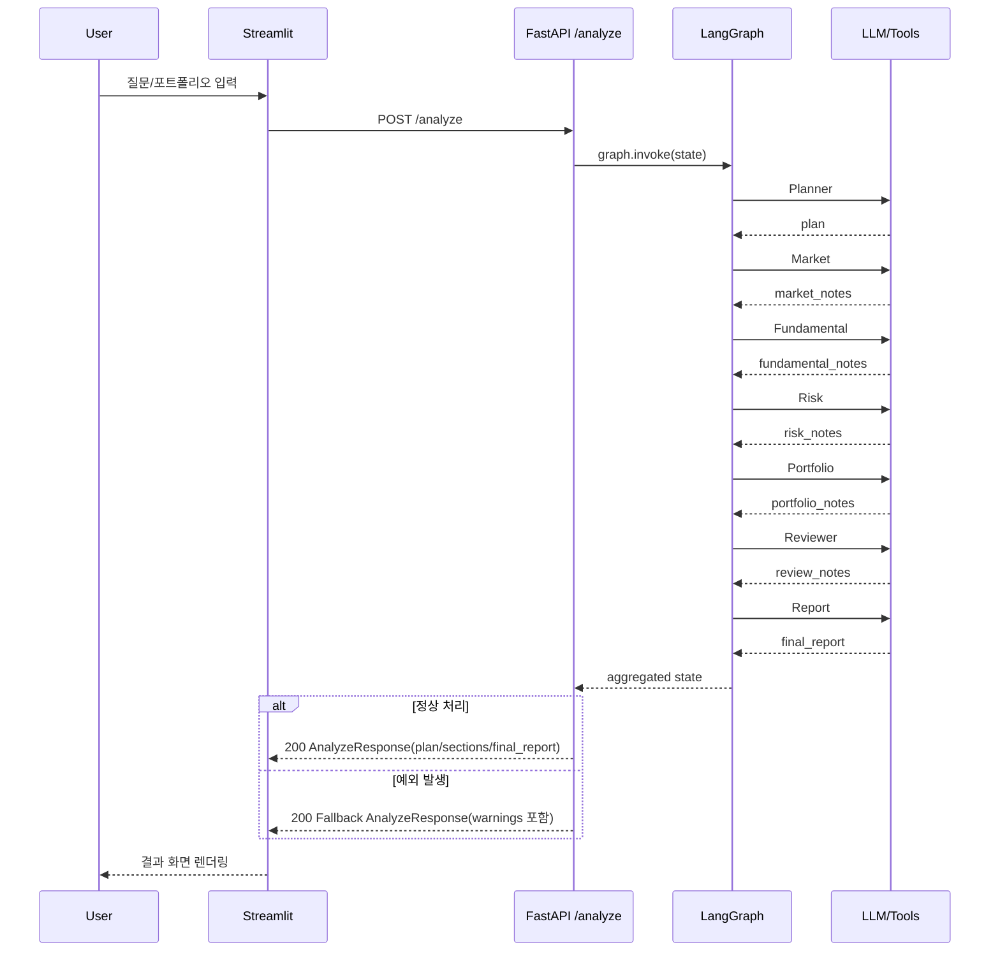

# InvestAI Agent

InvestAI Agent는 사용자의 질문과 포트폴리오 기준으로 시장 조사, 뉴스 요약, 포트폴리오 리스크 점검을 근거로 리포트 초안 작성을 수행합니다.

## 빠른 시작 (3줄)
```bash
source .venv/bin/activate
python -m uvicorn app.main:app --reload --host 127.0.0.1 --port 8000
python -m streamlit run streamlit_app.py --server.port 8501 --server.headless true
```

브라우저: `http://localhost:8501`  
Streamlit `FastAPI URL`: `http://127.0.0.1:8000`

## 핵심 기능
- Multi-Agent 구조 (단일 Agent 아님)
- LangGraph 기반 오케스트레이션
- Structured Output 기반 분석 결과 정리
- 포트폴리오 텍스트 입력 + 파일 업로드 병행 지원
- 분석 실행 중 입력 잠금(질문/포트폴리오/파일 업로드 비활성화)
- MCP/A2A 확장 고려 구조
- FastAPI + Streamlit 패키징

## Agent 구성
- Planner Agent: 사용자 질의를 작업 단위로 분해
- Market Agent: 시장/뉴스/가격 정보 수집
- Fundamental Agent: 재무/실적/밸류에이션 관점 분석
- Risk Agent: 리스크와 반대 시나리오 정리
- Portfolio Agent: 보유 종목과 포트폴리오 영향 평가
- Report Agent: 최종 투자 브리프 작성
- Reviewer Agent: 누락/과장/근거 부족 검토

## 프로젝트 구조
```text
Final/
├── app/
│   ├── agents/
│   │   ├── planner_agent.py
│   │   ├── market_agent.py
│   │   ├── fundamental_agent.py
│   │   ├── risk_agent.py
│   │   ├── portfolio_agent.py
│   │   ├── reviewer_agent.py
│   │   └── report_agent.py
│   ├── graphs/
│   │   └── investment_graph.py
│   ├── prompts/
│   │   └── system_prompts.py
│   ├── services/
│   │   ├── llm.py
│   │   └── market_tools.py
│   ├── config.py
│   ├── main.py
│   └── schemas.py
├── docs/
├── scripts/
│   └── check_aoai.py
├── tests/
├── streamlit_app.py
└── README.md
```

## 프로세스 흐름


### 시퀀스 다이어그램


## 실행 가이드

### 1) 프로젝트 이동 및 가상환경 준비
```bash
python3 -m venv .venv
source .venv/bin/activate
python -m pip install -r requirements.txt
```

### 2) 환경변수(.env) 설정
아래 값들을 `.env`에 설정합니다.

- `AOAI_ENDPOINT` : Azure OpenAI 엔드포인트
- `AOAI_API_KEY` : Azure OpenAI API Key
- `AOAI_DEPLOY_GPT4O_MINI` : 챗 배포명(예: `gpt-4o-mini`)
- `AOAI_API_VERSION` : 기본값 `2024-02-15-preview` (선택)


### 3) FastAPI 서버 실행 (백엔드)
기본 포트는 `8000`을 권장합니다.

```bash
source .venv/bin/activate
python -m uvicorn app.main:app --reload --host 127.0.0.1 --port 8000
```

확인:
```bash
curl -s http://127.0.0.1:8000/
```
정상 응답 예시:
```json
{"message":"InvestAI Agent"}
```

### 4) Streamlit 실행 (프론트엔드)
기본 포트는 `8501`입니다.

```bash
source .venv/bin/activate
python -m streamlit run streamlit_app.py --server.port 8501 --server.headless true
```

브라우저 접속:
- `http://localhost:8501`

Streamlit 사이드바의 `FastAPI URL` 값은 FastAPI 포트와 일치해야 합니다.
- FastAPI를 `8000`에서 실행했다면: `http://127.0.0.1:8000`
- FastAPI를 `8002`에서 실행했다면: `http://127.0.0.1:8002`

입력 규칙:
- `질문` 또는 `포트폴리오`(텍스트/파일) 중 하나 이상 입력해야 분석 실행 가능
- 질문과 포트폴리오가 모두 비어 있으면 `분석 실행` 버튼 비활성화
- 포트폴리오 파일(`txt`, `csv`) 업로드 시 텍스트 입력과 합쳐서 분석 요청

실행 중 동작:
- `분석 실행` 클릭 후 요청이 끝날 때까지 질문/포트폴리오/파일 업로드/사이드바 입력이 잠깁니다.
- 중복 클릭으로 인한 중복 요청을 방지합니다.

### 5) 포트 정보 요약
- **FastAPI**: `8000` (변경 가능)
- **Streamlit**: `8501` (변경 가능)

포트 사용 중 확인:
```bash
lsof -nP -iTCP:8000 -sTCP:LISTEN
lsof -nP -iTCP:8501 -sTCP:LISTEN
```

포트 점유 프로세스 종료:
```bash
kill -9 $(lsof -tiTCP:8501 -sTCP:LISTEN)
kill -9 $(lsof -tiTCP:8000 -sTCP:LISTEN)
```

### 6) 자주 발생하는 오류와 해결
- **`Connection refused (127.0.0.1:8000)`**
  - 원인: FastAPI 서버 미실행 또는 Streamlit의 API URL 포트 불일치
  - 해결: FastAPI 실행 후, Streamlit의 `FastAPI URL`을 실제 포트로 수정

- **`Port 8501 is already in use`**
  - 원인: 기존 Streamlit 프로세스가 이미 실행 중
  - 해결: 기존 프로세스를 종료하거나 `--server.port 8502`로 실행

- **`APIConnectionError` (OpenAI/Azure 호출 실패)**
  - 원인: 네트워크/DNS/프록시/키/엔드포인트 설정 문제
  - 해결: 아래 연결 점검 스크립트 실행 후 환경값 재확인

### Azure OpenAI 연결 점검
```bash
source .venv/bin/activate
python scripts/check_aoai.py
```

### VS Code 디버그 실행 방법
`.vscode/launch.json`에 아래 디버그 구성이 포함되어 있습니다.

- `FastAPI Debug (Final/app)`
  - 실행 대상: `uvicorn app.main:app`
  - 실행 포트: `8002`
- `Streamlit Debug`
  - 실행 대상: 현재 열려 있는 파일(`${file}`)
  - 실행 포트: `8501`

실행 순서:
1. VS Code에서 Run and Debug 패널 열기
2. FastAPI 디버그를 먼저 실행 (`FastAPI Debug (Final/app)`)
3. `streamlit_app.py` 파일을 활성화한 뒤 `Streamlit Debug` 실행
4. Streamlit 사이드바 `FastAPI URL`을 `http://127.0.0.1:8002`로 설정

디버그 시 포트 충돌이 나면:
- FastAPI 포트 확인: `lsof -nP -iTCP:8002 -sTCP:LISTEN`
- Streamlit 포트 확인: `lsof -nP -iTCP:8501 -sTCP:LISTEN`

### 실행 모드별 포트/URL 정리
- **CLI 모드(터미널 수동 실행)**
  - FastAPI: `127.0.0.1:8000`
  - Streamlit: `localhost:8501`
  - Streamlit `FastAPI URL`: `http://127.0.0.1:8000`

- **VS Code 디버그 모드(`launch.json`)**
  - FastAPI: `127.0.0.1:8002` (`FastAPI Debug (Final/app)`)
  - Streamlit: `localhost:8501` (`Streamlit Debug`)
  - Streamlit `FastAPI URL`: `http://127.0.0.1:8002`

- **핵심 규칙**
  - Streamlit의 `FastAPI URL` 포트는 현재 실행 중인 FastAPI 포트와 반드시 같아야 합니다.
  - 포트 충돌 시 기존 프로세스를 종료하거나, 한쪽 포트를 변경해 실행합니다.

## 주의
- 본 프로젝트는 투자 자문 대행이 아니라 분석 보조 도구 예제입니다.
- 실시간 시세/뉴스 API는 실제 환경에 맞게 교체해야 합니다.
