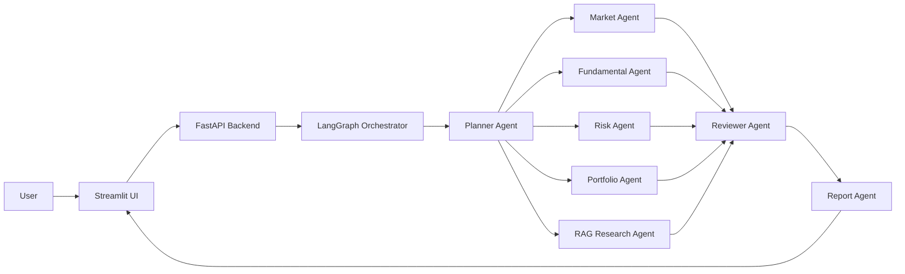
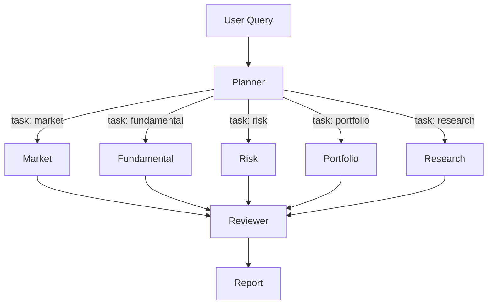
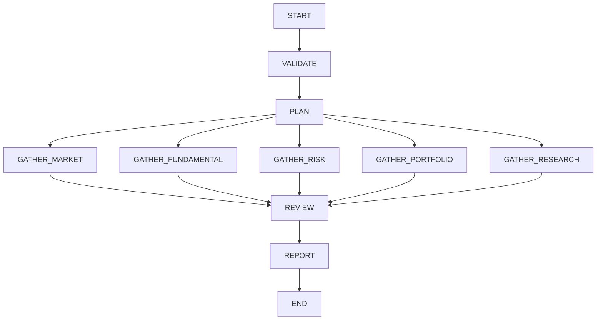
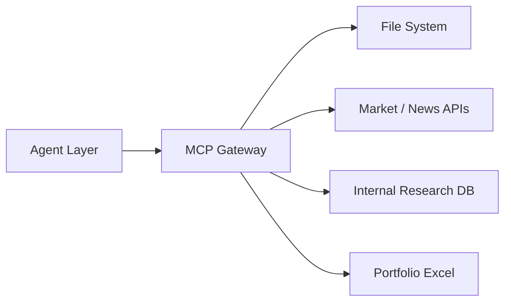
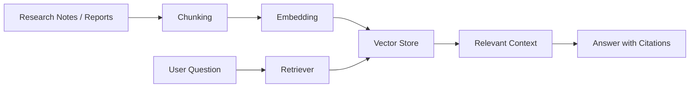
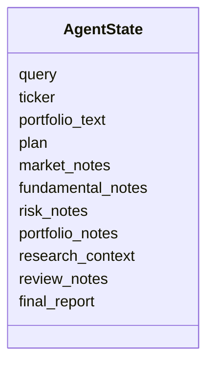

# AI 투자분석 Multi-Agent 설계 문서

## 1. 서비스 아키텍처

```mermaid
flowchart LR
    U[User] --> S[Streamlit UI]
    S --> F[FastAPI Backend]
    F --> O[LangGraph Orchestrator]
    O --> P[Planner Agent]
    P --> M[Market Agent]
    P --> FA[Fundamental Agent]
    P --> R[Risk Agent]
    P --> PO[Portfolio Agent]
    P --> RG[RAG Research Agent]
    M --> RE[Reviewer Agent]
    FA --> RE
    R --> RE
    PO --> RE
    RG --> RE
    RE --> RP[Report Agent]
    RP --> S
```

## 2. A2A 협업 구조

```mermaid
flowchart TD
    Q[User Query] --> Planner
    Planner -->|task: market| Market
    Planner -->|task: fundamental| Fundamental
    Planner -->|task: risk| Risk
    Planner -->|task: portfolio| Portfolio
    Planner -->|task: research| Research
    Market --> Reviewer
    Fundamental --> Reviewer
    Risk --> Reviewer
    Portfolio --> Reviewer
    Research --> Reviewer
    Reviewer --> Report
```

## 3. LangGraph 흐름

```mermaid
flowchart TD
    START --> VALIDATE
    VALIDATE --> PLAN
    PLAN --> GATHER_MARKET
    PLAN --> GATHER_FUNDAMENTAL
    PLAN --> GATHER_RISK
    PLAN --> GATHER_PORTFOLIO
    PLAN --> GATHER_RESEARCH
    GATHER_MARKET --> REVIEW
    GATHER_FUNDAMENTAL --> REVIEW
    GATHER_RISK --> REVIEW
    GATHER_PORTFOLIO --> REVIEW
    GATHER_RESEARCH --> REVIEW
    REVIEW --> REPORT
    REPORT --> END
```

## 4. MCP 연동 설계

```mermaid
flowchart LR
    Agent[Agent Layer] --> MCP[MCP Gateway]
    MCP --> FS[File System]
    MCP --> API[Market / News APIs]
    MCP --> DB[Internal Research DB]
    MCP --> XLS[Portfolio Excel]
```

## 5. RAG 파이프라인

```mermaid
flowchart LR
    D[Research Notes / Reports] --> C[Chunking]
    C --> E[Embedding]
    E --> V[Vector Store]
    Q[User Question] --> R[Retriever]
    R --> V
    V --> K[Relevant Context]
    K --> LLM[Answer with Citations]
```

## 6. 데이터 모델

```mermaid
classDiagram
    class AgentState {
        query
        ticker
        portfolio_text
        plan
        market_notes
        fundamental_notes
        risk_notes
        portfolio_notes
        research_context
        review_notes
        final_report
    }
```
