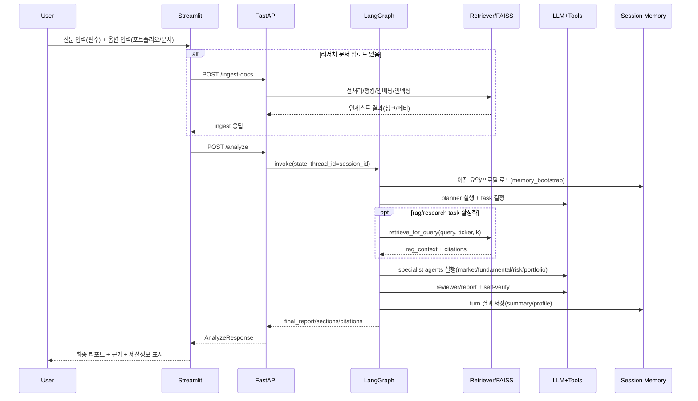

# InvestAI Agent 설계 문서 (구현 동기화판)

이 문서는 현재 `Final` 프로젝트의 실제 구현 상태를 기준으로 시스템 설계를 정리한다.

## 1. 설계 목표

- 질문 중심의 투자 분석 워크플로를 멀티에이전트로 분리해 일관된 브리프를 생성한다.
- 리서치 문서 기반 RAG를 실제 분석 단계(Planner 포함)에 주입한다.
- 도구 호출(`tool_choice=auto`)을 통해 정적 프롬프트 의존을 줄이고 최신 근거를 보강한다.
- 세션 기반 멀티턴 메모리를 지원해 대화 연속성과 재분석 생산성을 높인다.
- 입력 오류/LLM 오류를 구분해 API 소비자가 대응 가능한 에러 계약을 제공한다.

## 2. 실행 아키텍처

### 2.1 구성 요소

- API 레이어: `FastAPI` (`app/main.py`)
- 오케스트레이션: `LangGraph` (`app/graphs/investment_graph.py`)
- LLM/Tool 런타임: `OpenAI/AzureOpenAI + LangChain Tool`
- 문서 처리/RAG: `app/rag/*`, FAISS (`data/vector_store/faiss`)
- UI: `Streamlit` (`streamlit_app.py`)

### 2.2 상위 데이터 흐름

```mermaid
flowchart TD
    UI[Streamlit] -->|POST /ingest-docs (optional)| ING[Ingestion]
    UI -->|POST /analyze| API[FastAPI]
    API --> GRAPH[LangGraph App]
    GRAPH --> LLM[LLM + Tool Calling]
    GRAPH --> RAG[FAISS Retriever]
    GRAPH --> MEM[Checkpointer + Store]
    GRAPH --> API
    API --> UI
```

## 3. Agent Graph 설계

### 3.1 노드

- `memory_bootstrap`
- `planner`
- `rag`
- `market`
- `fundamental`
- `risk`
- `portfolio`
- `reviewer`
- `report`

### 3.2 라우팅 정책

- Entry: `memory_bootstrap -> planner`
- Planner 이후:
  - `tasks.rag or tasks.research == true`면 `rag` 선행
  - 아니면 활성화된 첫 specialist로 직행
- Specialist 간:
  - `next_specialist_after(...)`로 다음 활성 노드 결정
- 종단:
  - `portfolio -> reviewer -> report -> END`

### 3.3 핵심 상태(`AgentState`)

- 입력/컨텍스트:
  - `query`, `ticker`, `portfolio_text`, `risk_profile`
  - `session_id`, `turn_index`, `context_summary`, `memory_profile`, `contextual_query`
- 분석 산출:
  - `plan`
  - `rag_context`, `citations`
  - `market_notes`, `fundamental_notes`, `risk_notes`, `portfolio_notes`, `review_notes`
  - `final_report`

## 4. Tool Calling 설계

### 4.1 공통 런타임

`app/services/llm.py`의 `chat_with_tools`:

- OpenAI function-tool 스키마 변환
- 반복 호출 루프(`max_steps`)로 tool-call chain 수행
- 도구 인자 JSON 파싱 실패 시 `LLMJSONParseError(stage="tool_arguments")`
- LLM 호출 실패 시 `LLMInvocationError(subtype=...)`로 래핑

### 4.2 도구 목록

`app/tools/investment_tools.py`:

- `quote_lookup`
- `news_lookup`
- `fundamental_lookup`
- `portfolio_holdings`
- `rag_search`

추가로 역할별 묶음:

- `get_planner_tools()`
- `get_reviewer_tools()`
- `get_report_tools()`
- `extend_with_optional_mcp()` (환경설정 시 MCP 확장 도구 병합)

### 4.3 MCP 확장 포인트

`app/tools/mcp_tools.py`:

- 기본은 빈 리스트 반환 (기본 런타임 보호)
- `MCP_TOOLS_ENABLED=1`일 때 사용자 구현 로더를 통해 확장 가능

## 5. RAG 설계

### 5.1 데이터 수집/전처리 파이프라인

- 진입 경로
  - UI: `streamlit_app.py`에서 리서치 파일 업로드 시 `/ingest-docs`를 분석 실행 직전에 자동 호출
  - API: `app/main.py`의 `/ingest-docs`가 `IngestDocumentsRequest` 검증 후 전처리/인덱싱 수행
- 입력 포맷/소스
  - 지원 확장자: `md`, `txt`, `pdf`
  - 저장 경로: `data/research` (옵션 `save_to_research_dir=true`일 때)
  - PDF 처리: `app/rag/preprocess.py`에서 `pypdf.PdfReader`로 페이지별 텍스트 추출
- 전처리
  - `clean_text`: 제어문자 제거, URL 정규화, 불필요 공백 정리
  - 문서 유형 추론(`doc_type`) 및 티커/섹션 메타 보강
- 청킹
  - `chunk_documents`에서 `RecursiveCharacterTextSplitter` 기반 분할
  - 기본값: `chunk_size=900`, `chunk_overlap=120` (UI/API에서 사용자 조정 가능)
- 청크 메타데이터
  - `source_id`, `source_path`, `doc_type`, `ticker`, `section`, `chunk_index`, `hash`, `ingested_at`
  - 인제스트 응답에 `generated_chunks`, `chunk_previews`, `warnings` 포함

### 5.2 임베딩 모델 및 Vector DB 선택

- 임베딩 모델
  - OpenAI/Azure OpenAI 임베딩을 사용하며 모델명은 환경변수(`app/config.py`)로 관리
  - 임베딩 생성은 벡터스토어 로드/빌드 시점(`build_or_load_vector_store`)에 수행
- Vector DB
  - 선택: FAISS (`faiss-cpu`)
  - 이유: 로컬 개발 환경에서 빠른 유사도 검색, 단순한 파일 기반 운영, 별도 서버 의존성 최소화
- 저장/로딩 전략
  - 저장 경로: `data/vector_store/faiss`
  - `build_or_load_vector_store`가 인덱스 존재 여부에 따라 lazy load/build
  - 필요 시 `rebuild_index` 플래그로 전체 재색인
- 운영 제약
  - 파일 기반 인덱스 특성상 동시 업데이트/다중 인스턴스 운영에는 별도 락/배포 전략 필요

### 5.3 검색 로직과 응답 생성 방식

- 검색 진입점
  - 핵심 함수: `app/rag/retriever.py`의 `retrieve_for_query(query, ticker, k)`
  - 래퍼: `app/services/retriever.py`의 `retrieve_research_context` (테스트/호환 레이어)
- 검색 절차
  - 질의 임베딩 -> 유사도 top-k 검색
  - `ticker`가 있으면 메타 기반 필터 우선 적용, 결과 부족 시 후보 범위를 완화하는 fallback 수행
  - 결과를 `format_rag_context`로 모델 입력 친화 포맷으로 변환
- 그래프 내 주입 방식
  - Planner task에서 `rag/research`가 활성화되면 `rag` 노드 선행
  - `rag_context`와 `citations`가 이후 specialist 및 `report` 노드로 전달됨
  - Planner/Reviewer/Report는 `rag_search` tool도 호출 가능하여 필요 시 재조회
- 최종 응답 생성
  - 각 agent 산출 + RAG 근거를 종합해 `report` 노드에서 `final_report` 생성
  - `report_verify_agent`의 self-verify 루프로 형식/근거 일관성 재검증 후 확정
  - API 응답은 `final_report`, `sections`, `citations`를 함께 반환해 근거 추적 가능성을 유지

## 6. 멀티턴 메모리 설계

### 6.1 저장소 구성

- Checkpointer: `MemorySaver`
- Store: `InMemoryStore`
- namespace: `("conversation", "investai")`

### 6.2 저장/조회 계약

- 저장 시점: `report_node` 완료 후
- 저장 필드:
  - `turn_index`
  - `last_query`
  - `last_report_summary`
  - `memory_profile`
  - `updated_at`
- API:
  - `GET /memory/{session_id}`
  - `reset_session_memory(session_id)`

### 6.3 구조화 메모리(`memory_profile`)

생성 경로:

1. `memory_profile_agent.build_memory_profile_with_llm(...)` 우선
2. 실패 시 `_extract_structured_memory(...)` 규칙 기반 fallback

스키마:

- `last_user_intent`
- `risk_profile`
- `key_risks[]`
- `action_items[]`
- `last_report_excerpt`
- `carry_over_flags[]` (typed)
  - `{type: risk|fundamental|market|portfolio|other, note: ...}`

### 6.4 플래너 보정

`planner_agent._apply_memory_flags(...)`:

- `carry_over_flags` typed 항목을 우선 해석
- legacy string flag도 하위호환
- 관련 task를 강제로 `true` 보정
- flag 존재 시 `research/rag`를 꺼두지 않음

## 7. API/스키마 설계

### 7.1 입력 검증 (`AnalyzeRequest`)

- `risk_profile` enum 강제
- `query`/`portfolio_text` 상호 규칙 검증
- 포트폴리오 형식 규칙 검증
- 멀티턴 필드:
  - `session_id`
  - `reset_memory`

### 7.2 응답 (`AnalyzeResponse`)

- `session_id`, `turn_index`
- `memory_summary`, `memory_profile`
- `plan`, `sections`, `final_report`, `citations`, `warnings`

### 7.3 에러 핸들러

- `LLMInvocationError` -> 403/429/503/502 분기
- `LLMJSONParseError` -> 422
- `RequestValidationError` -> 422
  - `jsonable_encoder(... custom_encoder={Exception: str})`로 직렬화 안전성 보장

## 8. 프롬프트/검증 루프 설계

- `advanced_prompting.py`
  - Few-shot
  - 인용 규칙
  - 자기검증 시스템 프롬프트
- `report_verify_agent.py`
  - 리포트 초안에 대해 JSON self-check 라운드(`max_rounds=2`)
  - 만족/심각도 기반 조기 종료

## 9. Streamlit UX 설계 (현재 반영)

- 메인 화면 중심 입력:
  - 질문(필수)
  - 포트폴리오(선택)
  - 리서치 문서 업로드(선택)
- 리서치 문서 업로드 시 분석 실행 전에 자동 `/ingest-docs`
- Chunk 설정 아래에
  - ingest 상태
  - 생성된 문서/청크 메타데이터
  - 질문 기반 RAG 검색 결과

## 10. 운영 이슈/제약

- AOAI Private Endpoint 경로가 맞지 않으면 403 (`permission_denied`)
- 인메모리 스토어는 프로세스 재시작 시 세션 메모리 유실
- FAISS 로컬 파일 기반이므로 동시 업데이트/배포 전략 별도 필요

## 11. 검증 전략

- 단위 테스트(`unittest`)로 핵심 계약 고정:
  - retriever 동작
  - RAG 포맷
  - memory bootstrap/reset
  - memory profile 정규화
  - carry-over typed flag 보정
- 런타임 smoke:
  - `/` health
  - `/analyze` validation path (422)
  - `/ingest-docs` pipeline

## 12. 확장 계획

- persistent store(redis/sql)로 세션 메모리 영속화
- reranker 도입으로 RAG 정밀도 향상
- tool trace를 기준으로 근거 신뢰도 점수 부여
- MCP 도구 로더 실제 구현 및 권한/타임아웃 관리

## 13. API 계약 상세

### 13.1 `/analyze` 요청 스키마

- `query: str`  
  - 최소 5자 이상 또는 `portfolio_text`가 유효 형식이어야 함.
- `ticker: str | null`  
  - 시세/재무 툴에게 힌트 제공, RAG 필터에도 사용 가능.
- `portfolio_text: str | null`  
  - `parse_portfolio_text`로 구조화, Portfolio Agent와 Risk Agent에 전달.
- `risk_profile: "conservative" | "balanced" | "aggressive"`
- `session_id: str | null`  
  - 없으면 서버에서 UUID 발급.
- `reset_memory: bool`  
  - true면 해당 `session_id`의 LangGraph 체크포인트 + Store 메모리 삭제 후 이번 턴부터 새로 쌓기.

### 13.2 `/analyze` 응답 스키마

- `session_id: str`
- `turn_index: int`
- `memory_summary: str`
- `memory_profile: dict`
  - `last_user_intent`, `risk_profile`, `key_risks`, `action_items`, `last_report_excerpt`, `carry_over_flags`.
- `plan: dict`
  - `objective`, `tasks`, `output_style`.
- `sections: AgentSection[]`
  - `title`, `summary`, `bullets`, `evidence`.
- `final_report: str`
- `citations: dict[str, Citation[]]`
- `warnings: str[]`

### 13.3 `/ingest-docs`

- 입력 `IngestDocumentsRequest`:
  - `documents: ResearchDocumentInput[]`
  - `chunk_size`, `chunk_overlap`
  - `save_to_research_dir`, `rebuild_index`
- 출력 `IngestDocumentsResponse`:
  - `input_documents`, `accepted_documents`, `generated_chunks`
  - `saved_files`, `chunk_previews`, `warnings`

### 13.4 `/memory/{session_id}`

- 입력: path param `session_id`
- 출력 `SessionMemoryResponse`:
  - `turn_index`, `updated_at`, `last_query`, `memory_summary`, `memory_profile`

## 14. UI 스크린 플로우

### 14.1 메인 화면

- 사이드바
  - FastAPI URL
  - Risk Profile
  - Conversation Session ID + 세션 메모리 초기화 버튼
- 메인 본문
  - 질문 입력(필수, 규칙 안내 문구 포함)
  - 포트폴리오 텍스트/파일 업로드(선택)
  - 리서치 문서 업로드 + Chunk 설정(선택)
  - Chunk 설정 아래:
    - 인제스트 결과/경고
    - 생성된 문서/청크 메타데이터
    - 질문 기반 RAG 검색 결과
  - 분석 실행 버튼

### 14.2 결과 영역

- Session/Turn 정보
- Session Memory Profile(JSON 뷰)
- 질문 원문
- 분석 결과(최종 브리프)
- Planner Plan
- Agent별 결과(expander)
- Citations(expander)

## 15. 사용자 시나리오/구조/플로우 (발표 자료용)

### 3.1 사용자 시나리오(Use Case Scenario)

#### 사용자 목표와 과제 흐름

- 목표
  - 투자 질문(예: 특정 종목 매수/비중 조정/리스크 점검)에 대해 근거 기반의 분석 리포트를 빠르게 확인한다.
  - 필요 시 포트폴리오와 리서치 문서를 함께 제공해 맞춤형 분석 정확도를 높인다.
- 과제 흐름
  - 질문을 입력한다(필수).
  - 포트폴리오 텍스트/파일을 선택적으로 입력한다.
  - 리서치 문서를 선택적으로 업로드하고 청크 파라미터를 설정한다.
  - 분석 실행 후 최종 리포트, 에이전트별 결과, 인용 근거를 확인한다.
  - 같은 `session_id`를 유지해 후속 질문을 이어가고, 필요 시 메모리를 초기화한다.

#### 서비스 이용 단계별 행동 정의

1. 접속/설정
   - 사용자는 Streamlit 화면에서 API URL, `risk_profile`, `session_id`를 설정한다.
2. 입력 준비
   - 필수: 질문(`query`) 입력
   - 선택: 포트폴리오 입력, 리서치 문서 업로드(`md/txt/pdf`)
3. 문서 인제스트(선택)
   - 문서가 있으면 `/ingest-docs`가 먼저 실행되어 전처리/청킹/인덱싱을 수행한다.
4. 분석 요청
   - `/analyze` 호출로 LangGraph 멀티에이전트 파이프라인이 실행된다.
5. 결과 확인
   - 최종 리포트, 세션 메모리, planner plan, agent 결과, citations를 확인한다.
6. 반복/후속 질의
   - 같은 세션으로 다음 질문을 보내 멀티턴 분석을 이어가거나 `reset_memory`로 세션을 리셋한다.

### 3.2 시스템 구조도 / Multi-Agent 다이어그램

아래 두 가지를 모두 포함한다.

#### 시스템 전체 구조도

```mermaid
flowchart LR
    U[사용자] --> UI[Streamlit 화면]

    subgraph APP[InvestAI 서비스]
        API[FastAPI]
        LG[LangGraph 오케스트레이터]
        LLM[LLM + Tool Calling]
        RAG[전처리/검색 모듈]
        VS[(FAISS Vector DB)]
        MEM[(세션 메모리<br/>MemorySaver + InMemoryStore)]
    end

    UI -->|분석 요청| API
    UI -->|문서 업로드(선택)| API
    API --> LG
    LG --> LLM
    LG --> RAG
    RAG --> VS
    LG --> MEM
    LG --> API
    API -->|분석 결과 + 인용근거| UI

    classDef user fill:#E8F4FF,stroke:#2B6CB0,stroke-width:1.5px,color:#1A365D;
    classDef ui fill:#E6FFFA,stroke:#0F766E,stroke-width:1.5px,color:#134E4A;
    classDef core fill:#F3E8FF,stroke:#7E22CE,stroke-width:1.5px,color:#581C87;
    classDef data fill:#FFF7ED,stroke:#C2410C,stroke-width:1.5px,color:#7C2D12;
    classDef memory fill:#FEF3C7,stroke:#B45309,stroke-width:1.5px,color:#78350F;

    class U user;
    class UI ui;
    class API,LG,LLM,RAG core;
    class VS data;
    class MEM memory;
```

#### Multi-Agent 구성도(LangGraph)

```mermaid
flowchart TD
    M[memory_bootstrap<br/>이전 대화 로드] --> P[planner<br/>분석 계획 수립]
    P --> D{RAG 필요?}
    D -->|Yes| R[rag<br/>문서 검색]
    D -->|No| MK[market]
    R --> MK[market<br/>시세/뉴스]
    MK --> F[fundamental<br/>재무]
    F --> RK[risk<br/>리스크]
    RK --> PF[portfolio<br/>포트폴리오]
    PF --> RV[reviewer<br/>품질 점검]
    RV --> RP[report<br/>최종 보고서]
    RP --> END((END))

    P -.도구 호출.-> T1[quote/news/rag_search]
    RV -.도구 호출.-> T2[rag_search]
    RP -.도구 호출.-> T3[rag_search + market/fundamental]

    classDef memory fill:#FEF3C7,stroke:#B45309,stroke-width:1.5px,color:#78350F;
    classDef planner fill:#EDE9FE,stroke:#6D28D9,stroke-width:1.5px,color:#4C1D95;
    classDef rag fill:#DBEAFE,stroke:#1D4ED8,stroke-width:1.5px,color:#1E3A8A;
    classDef specialist fill:#DCFCE7,stroke:#15803D,stroke-width:1.5px,color:#14532D;
    classDef quality fill:#FCE7F3,stroke:#BE185D,stroke-width:1.5px,color:#831843;
    classDef end fill:#E5E7EB,stroke:#374151,stroke-width:1.5px,color:#111827;
    classDef tool fill:#FFF7ED,stroke:#C2410C,stroke-width:1.2px,color:#7C2D12;

    class M memory;
    class P,D planner;
    class R rag;
    class MK,F,RK,PF specialist;
    class RV,RP quality;
    class END end;
    class T1,T2,T3 tool;
```

### 3.3 서비스 플로우(Flow Chart / Sequence Diagram 등)

사용자 요청 → Agent 처리 → RAG 검색 → 응답 생성 → UI 출력까지의 시퀀스:



### 3.4 LLM Fundamentals 기반 Structured Output / Function Calling

#### Structured Output (실구현)

- JSON 기반 구조화 응답을 핵심 계약으로 사용한다.
  - Planner: `objective/tasks/output_style` 형태의 plan JSON 생성
  - Memory Profile: `last_user_intent`, `key_risks`, `action_items`, `carry_over_flags` 등 구조화 필드 생성
- 구현 위치
  - `app/services/llm.py`
    - `json_chat(...)`, `run_prompt_chain_json(...)`
    - `parse_json_object_from_assistant_text(...)`로 코드펜스/주변 텍스트 포함 응답에서도 JSON 객체 추출
- 안정성 처리
  - JSON 파싱 실패 시 `LLMJSONParseError(stage=...)`로 분리 응답(HTTP 422)
  - LLM 호출 실패는 `LLMInvocationError(subtype=...)`로 분리(403/429/503/502 매핑)

#### Function Calling (실구현)

- OpenAI tool/function calling을 `tool_choice=auto`로 사용한다.
- 구현 위치
  - `app/services/llm.py`의 `chat_with_tools(...)`
    - tool schema 변환
    - tool call loop(`max_steps`) 실행
    - 도구 인자 JSON 파싱 및 예외 처리
  - `app/tools/investment_tools.py`
    - `quote_lookup`, `news_lookup`, `fundamental_lookup`, `portfolio_holdings`, `rag_search`
    - role별 tool bundle(`get_planner_tools`, `get_reviewer_tools`, `get_report_tools`)
- 적용 방식
  - Planner/Reviewer/Report가 상황에 따라 도구를 호출해 근거를 보강하고, 결과를 최종 보고서와 인용 정보에 반영한다.

### 3.5 MCP 기반 파일·시스템·API 연동

#### 현재 구현 상태 (실구현)

- MCP 확장을 위한 안전한 연결 포인트를 구현했다.
  - 파일: `app/tools/mcp_tools.py`
  - `optional_mcp_tools()`가 환경변수 `MCP_TOOLS_ENABLED`를 확인해 MCP 도구를 동적으로 병합
  - 기본값은 빈 리스트 반환(미설정 시 런타임 영향 없음)
- 기존 도구 체계와의 통합
  - `extend_with_optional_mcp(...)`를 통해 planner/reviewer/report tool set에 MCP 도구를 추가할 수 있음

#### 연동 범위 정의

- 파일/시스템/API 자원에 대한 MCP 기반 접근은 "확장 가능 구조"까지 반영되어 있으며,
  실제 외부 MCP 서버/도구 구현(`load_mcp_stdio_tools`)은 프로젝트 환경에 맞춰 후속 연결하도록 설계됨.
- 즉, 본 프로젝트는 **MCP-ready 구조(Integration Point)** 를 구현했고, 도메인별 MCP 서버 연결은 운영 환경 단계에서 활성화한다.

### 3.6 A2A 기반 Agent 협업 구조

#### 현재 협업 구조 (실구현)

- 본 서비스의 에이전트 협업은 LangGraph 상태 기반 오케스트레이션으로 구현되어 있다.
  - 노드: `memory_bootstrap -> planner -> rag -> market -> fundamental -> risk -> portfolio -> reviewer -> report`
  - 상태 공유: `AgentState`를 통해 `plan`, `rag_context`, `citations`, specialist notes, `memory_profile` 전달
  - 동적 라우팅: planner task 및 carry-over flag에 따라 실행 노드/순서를 조정
- 의미상 A2A(Agent-to-Agent) 협업
  - 각 agent의 산출물이 다음 agent 입력으로 전달되고, reviewer/report가 이를 종합해 최종 응답을 생성
  - 독립 agent 간 메시지 교환 효과를 그래프 상태 전이로 구현

#### A2A 관점 정리

- 표준 A2A 프로토콜 서버를 직접 붙인 구조는 아니지만,
  실질적으로는 "Agent 간 역할 분리 + 상태 전달 + 순차/조건부 협업"을 충족한다.
- 추후 표준 A2A 프로토콜을 도입할 경우에도 현재 노드/상태 계약(`AgentState`, node I/O)을 adapter 계층으로 매핑하기 쉬운 구조다.

### 3.7 발표용 한 줄 요약 (3.4~3.6)

- **Structured Output / Function Calling**: LLM 응답을 JSON 계약으로 고정하고, function-calling으로 실시간 도구 조회를 결합해 근거 중심 분석을 생성한다.
- **MCP 연동**: 현재는 MCP 도구를 안전하게 주입할 수 있는 MCP-ready 구조를 구현했으며, 운영 환경에서 파일·시스템·외부 API 서버를 선택적으로 연결한다.
- **A2A 협업**: LangGraph에서 역할 분리된 에이전트가 상태를 이어받아 순차/조건부로 협업하며, reviewer/report 단계에서 결과를 통합해 최종 리포트를 만든다.
