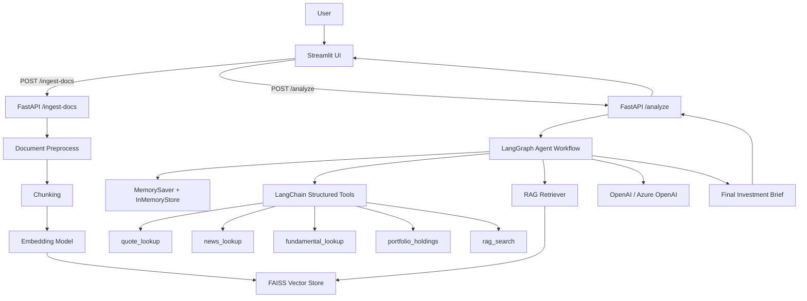
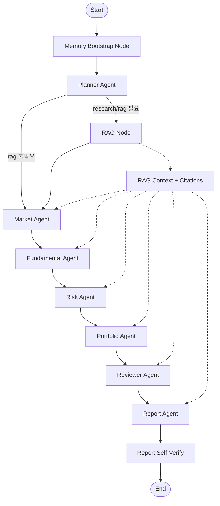
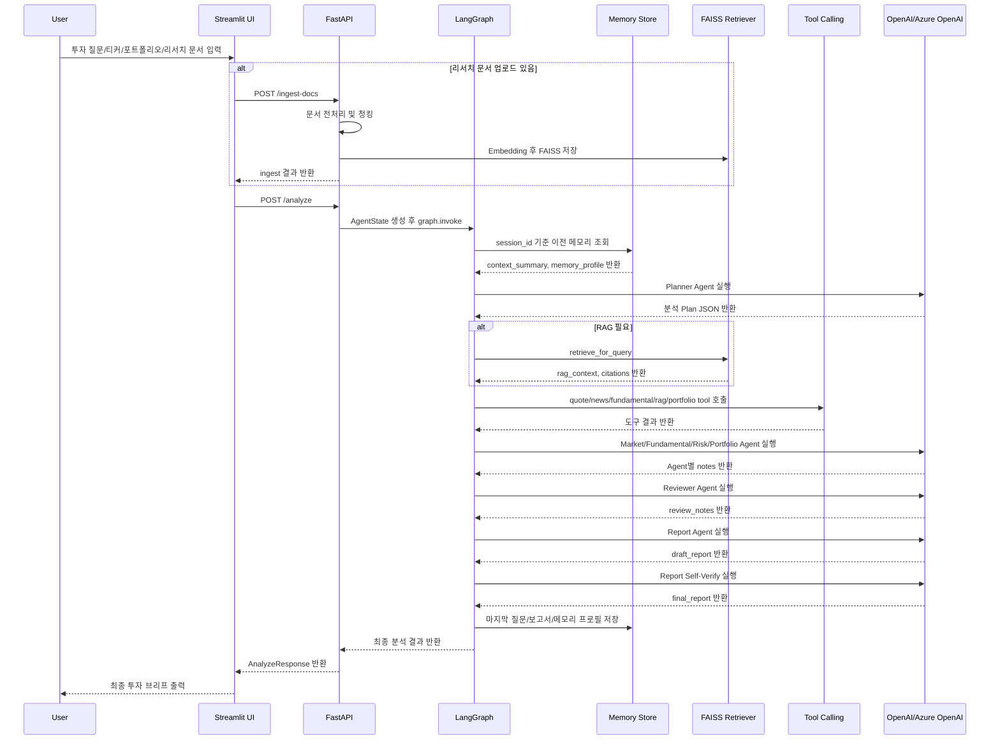

아래 내용은 첨부한 `Final_20260507.zip` 구현 소스 기준으로 작성한 **과제 제출용 기획/설계 답변 초안**입니다. 프로젝트명은 소스 기준으로 **InvestAI Agent**로 정리했습니다.

---

# InvestAI Agent 기획 및 설계 문서

## **1. 프로젝트 개요 – 기획 배경 및 핵심 내용**

### **1.1 프로젝트 기획 배경**

#### 어떤 문제를 해결하고자 하는가?

투자 의사결정을 위해서는 시장 뉴스, 주가 흐름, 기업 재무, 밸류에이션, 리스크, 포트폴리오 영향까지 여러 관점의 정보를 함께 검토해야 한다. 그러나 일반 사용자는 이러한 정보를 여러 사이트와 리포트에서 개별적으로 확인한 뒤 직접 종합해야 하므로 분석 시간이 오래 걸리고, 판단 기준도 일관되기 어렵다.

본 프로젝트는 사용자의 투자 질문과 보유 포트폴리오 정보를 입력받아, 여러 전문 Agent가 역할을 나누어 분석하고 최종 투자 브리프를 생성하는 **AI 기반 투자 분석 Copilot 서비스**를 구현하는 것을 목표로 한다.

#### 기존 방식의 한계는 무엇인가?

기존 투자 정보 탐색 방식은 다음과 같은 한계를 가진다.

| 구분     | 기존 방식의 한계                              |
| ------ | -------------------------------------- |
| 정보 수집  | 뉴스, 시세, 재무 정보, 리서치 자료가 여러 곳에 분산되어 있음   |
| 분석 관점  | 시장, 재무, 리스크, 포트폴리오 관점이 분리되어 종합 판단이 어려움 |
| 사용자 부담 | 사용자가 직접 자료를 찾고, 비교하고, 해석해야 함           |
| 일관성    | 질문마다 분석 기준이 달라질 수 있음                   |
| 근거 관리  | 어떤 근거를 바탕으로 판단했는지 추적하기 어려움             |
| 멀티턴 대응 | 이전 질문과 결론을 기억하지 못해 연속 분석이 어려움          |

#### Agent 서비스로 해결할 수 있는 Pain Point는 무엇인가?

InvestAI Agent는 단일 챗봇이 모든 내용을 한 번에 답변하는 방식이 아니라, **Planner → RAG → Market → Fundamental → Risk → Portfolio → Reviewer → Report**로 이어지는 Multi-Agent 구조를 통해 분석 과정을 분리한다.

이를 통해 다음 Pain Point를 해결한다.

| Pain Point       | Agent 서비스 해결 방식                         |
| ---------------- | --------------------------------------- |
| 무엇부터 분석해야 할지 모름  | Planner Agent가 질문을 분석 작업으로 분해           |
| 시장/재무/리스크가 혼재됨   | 전문 Agent별 역할 분리                         |
| 내부 리서치 자료 활용 어려움 | RAG 검색을 통해 업로드 문서 기반 근거 활용              |
| 출처 없는 단정형 응답 위험  | Reviewer Agent와 Report Self-Verify로 검증  |
| 이전 분석 맥락 단절      | MemorySaver와 InMemoryStore 기반 세션 메모리 유지 |
| 포트폴리오 관점 부족      | Portfolio Agent가 사용자 보유 비중 관점 분석        |

#### 이 프로젝트를 시작하게 된 동기는 무엇인가?

이 프로젝트는 LangChain/LangGraph 기반의 End-to-End AI Agent 서비스를 직접 설계하고 구현하기 위한 과제에서 출발했다. 단순 LLM 챗봇이 아니라, 실제 사용자가 체감할 수 있는 분석 흐름을 만들기 위해 투자 분석이라는 복합 의사결정 문제를 선택했다.

투자 분석은 질문 분해, 도구 호출, RAG 검색, 구조화 응답, 리스크 검토, 사용자 맥락 기억이 모두 필요한 영역이다. 따라서 Multi-Agent, Tool Calling, RAG, Memory, Structured Output 등 Agentic AI의 주요 요소를 종합적으로 보여주기에 적합한 주제라고 판단했다.

---

### **1.2 핵심 아이디어 및 가치 제안(Value Proposition)**

#### 서비스가 제공하는 핵심 기능은 무엇인가?

InvestAI Agent의 핵심 기능은 다음과 같다.

| 핵심 기능             | 설명                                                              |
| ----------------- | --------------------------------------------------------------- |
| 투자 질문 분석          | 사용자의 자연어 질문을 분석 목적과 하위 작업으로 분해                                  |
| Multi-Agent 투자 분석 | 시장, 재무, 리스크, 포트폴리오 관점별 전문 Agent 분석                              |
| RAG 기반 리서치 활용     | 사용자가 업로드한 `md`, `txt`, `pdf` 문서를 전처리 후 FAISS Vector DB에 저장하고 검색 |
| Tool Calling      | 시세, 뉴스, 재무, 포트폴리오 파싱, RAG 검색 도구 호출                              |
| 포트폴리오 분석          | 사용자가 입력한 보유 종목/비중 정보를 기반으로 집중도와 리스크 검토                          |
| 멀티턴 메모리           | 세션 ID 기준으로 이전 분석 요약과 사용자 성향, 주요 리스크를 기억                         |
| 최종 투자 브리프 생성      | Agent별 분석 결과를 종합해 5개 섹션 구조의 투자 브리프 생성                           |
| 자기검증 루프           | Report 생성 후 self-check를 통해 근거 부족, 과장, 허위 수치 가능성 검토              |

#### 사용자에게 제공되는 가치와 기대효과는 무엇인가?

| 제공 가치       | 기대효과                                    |
| ----------- | --------------------------------------- |
| 분석 시간 단축    | 여러 자료를 직접 검색하지 않아도 핵심 투자 판단 포인트를 빠르게 확인 |
| 분석 기준 표준화   | 질문마다 일관된 분석 흐름과 출력 구조 제공                |
| 리스크 인식 강화   | 투자 기회뿐 아니라 하방 리스크와 반대 시나리오까지 함께 검토      |
| 포트폴리오 관점 반영 | 단일 종목 분석을 넘어 보유 비중과 자산 배분 영향까지 확인       |
| 근거 기반 응답    | RAG 문서, 시세/뉴스/재무 도구 결과를 활용해 응답 신뢰도 향상   |
| 연속 상담 가능    | 이전 대화의 리스크, 액션 아이템, 사용자 의도를 다음 분석에 반영   |

#### 기존 서비스 대비 차별성은 무엇인가?

| 구분       | 일반 챗봇/검색 서비스  | InvestAI Agent                           |
| -------- | ------------- | ---------------------------------------- |
| 분석 방식    | 단일 응답 생성      | Multi-Agent 역할 분담                        |
| 워크플로     | 질문 → 답변       | Planner → Specialist → Reviewer → Report |
| 리서치 활용   | 일반 웹/모델 지식 중심 | 업로드 문서 기반 RAG 검색 가능                      |
| 포트폴리오 반영 | 제한적           | 사용자 입력 포트폴리오 파싱 및 분석                     |
| 검증 구조    | 별도 검증 없음      | Reviewer Agent + Report Self-Verify      |
| 멀티턴      | 대화 기억 제한적     | session_id 기반 메모리 관리                     |
| 확장성      | 서비스 내부 구조 불명확 | MCP, A2A, Tool 확장 포인트 설계                 |

---

### **1.3 대상 사용자 및 기대 사용자 경험(UX)**

#### 주요 타겟

| 대상 사용자           | 설명                                        |
| ---------------- | ----------------------------------------- |
| 개인 투자자           | 특정 종목의 추가매수, 보유, 매도 판단을 구조적으로 검토하고 싶은 사용자 |
| 포트폴리오 보유자        | 보유 종목 비중, 집중도, 리스크를 함께 보고 싶은 사용자          |
| 투자 리서치 실무자       | 리서치 초안, 투자 브리프, 리스크 검토 메모가 필요한 사용자        |
| AI Agent 학습자/개발자 | LangGraph 기반 Multi-Agent 구조를 참고하려는 개발자    |
| 부트캠프/포트폴리오 평가자   | Agentic AI 구현 역량을 확인하려는 평가자               |

#### 사용자에게 어떤 흐름과 경험을 제공할 것인가?

사용자는 Streamlit UI에서 투자 질문, 티커, 포트폴리오 정보, 리스크 성향, 리서치 문서를 입력한다. 이후 시스템은 FastAPI를 통해 LangGraph Agent Workflow를 실행하고, 각 Agent가 순차적으로 분석을 수행한다.

사용자 경험 흐름은 다음과 같다.

1. 사용자가 투자 질문 입력
   예: “SK하이닉스 지금 보유할지 줄일지 리스크까지 분석해줘.”

2. 선택적으로 티커, 포트폴리오, 리스크 성향 입력
   예: `ticker=000660.KS`, `risk_profile=balanced`

3. 리서치 문서가 있으면 업로드
   예: 증권사 리포트 PDF, 개인 메모 TXT, 기업 분석 MD

4. 시스템이 문서를 전처리하고 FAISS Vector DB에 색인

5. Planner Agent가 질문을 분석 작업으로 분해

6. RAG Node가 관련 문서 검색

7. Market, Fundamental, Risk, Portfolio Agent가 역할별 분석 수행

8. Reviewer Agent가 누락, 과장, 근거 부족을 점검

9. Report Agent가 최종 투자 브리프 작성

10. UI에서 최종 보고서와 섹션별 분석 결과 확인

#### 사용자가 서비스에서 얻는 구체적 Benefit은 무엇인가?

| Benefit        | 설명                                 |
| -------------- | ---------------------------------- |
| 빠른 투자 브리프 확보   | 여러 자료를 직접 확인하지 않아도 분석 요약을 즉시 확인    |
| 판단 포인트 명확화     | 매수/보유/축소 판단 전에 확인해야 할 핵심 근거 제공     |
| 리스크 중심 사고 강화   | 긍정적 전망뿐 아니라 하방 리스크와 반대 시나리오 확인     |
| 개인 포트폴리오 맞춤 분석 | 보유 비중과 리스크 성향을 반영한 분석 가능           |
| 반복 분석 효율화      | 이전 분석 메모리를 활용해 다음 질문에서 맥락 유지       |
| 리서치 자료 재활용     | 업로드 문서를 RAG로 검색해 개인/내부 자료 기반 분석 가능 |

---

## **2. 기술 구성 – 서비스에 적용할 기술 스택**

### **2.1 Prompt Engineering 전략**

#### 역할 기반 프롬프트

본 프로젝트는 Agent별 역할을 명확하게 분리한 시스템 프롬프트를 사용한다.

| Agent               | 역할 기반 프롬프트 전략                                                      |
| ------------------- | ------------------------------------------------------------------ |
| Planner Agent       | 사용자 질문을 market, fundamental, risk, portfolio, research/rag 작업으로 분해 |
| Market Agent        | 시장 분위기, 뉴스, 가격 흐름 중심 분석                                            |
| Fundamental Agent   | 재무, 실적, 밸류에이션 중심 분석                                                |
| Risk Agent          | 하방 리스크, 이벤트 리스크, 반대 시나리오 분석                                        |
| Portfolio Agent     | 사용자 포트폴리오 비중, 집중도, 분산 관점 분석                                        |
| Reviewer Agent      | 누락된 근거, 과장 표현, 충돌 해석 검토                                            |
| Report Agent        | 최종 투자 브리프 작성                                                       |
| Report Verify Agent | 최종 보고서의 근거, 형식, 수치 조작 가능성 검증                                       |

#### CoT/Few-shot 등 고품질 응답 전략

구현 소스에서는 Chain-of-Thought를 직접 노출하기보다는, Agent별 판단 기준과 Few-shot 예시를 통해 고품질 응답을 유도한다.

적용된 전략은 다음과 같다.

| 전략                 | 구현 방식                                  |
| ------------------ | -------------------------------------- |
| Few-shot Prompting | Planner, Reviewer, Report 형식 예시 제공     |
| 역할 분리              | Agent별 전문 프롬프트로 응답 관점 분리               |
| 자기검증               | Report 생성 후 JSON 기반 self-check 수행      |
| 근거 우선 규칙           | 주요 단정마다 출처 또는 한계 명시                    |
| 안전한 투자 표현          | 투자 권유처럼 단정하지 않고 판단 포인트 중심 작성           |
| 모르는 값 처리           | 입력/도구 결과에 없는 수치, 날짜, 목표주가는 생성하지 않도록 제한 |

#### 출력 구조화 템플릿 정의

출력 구조화는 크게 세 단계로 적용된다.

첫째, Planner Agent는 JSON 구조로 분석 계획을 생성한다.

```json
{
  "objective": "사용자 질문의 분석 목적",
  "tasks": {
    "market": true,
    "fundamental": true,
    "risk": true,
    "portfolio": true,
    "research": true,
    "rag": true
  },
  "output_style": "근거 기반 투자 브리프"
}
```

둘째, FastAPI 응답은 `AnalyzeResponse` 스키마로 구조화된다.

| 응답 필드          | 설명                   |
| -------------- | -------------------- |
| session_id     | 사용자 세션 ID            |
| turn_index     | 대화 턴 번호              |
| memory_summary | 이전 분석 요약             |
| memory_profile | 구조화된 사용자/분석 메모리      |
| plan           | Planner Agent의 분석 계획 |
| sections       | Agent별 분석 섹션         |
| final_report   | 최종 투자 브리프            |
| citations      | RAG 및 Tool 근거 정보     |
| warnings       | 경고 메시지               |

셋째, 최종 리포트는 고정된 5개 섹션으로 작성된다.

1. 한줄 결론
2. 핵심 근거 3개
3. 리스크 3개
4. 포트폴리오 관점
5. 추가 확인 필요

#### 사용자 유형/상황별 프롬프트 분기

사용자 입력의 `risk_profile`에 따라 Planner Agent의 분석 우선순위가 달라진다.

| risk_profile | 프롬프트 분기               |
| ------------ | --------------------- |
| conservative | 리스크 점검과 자본보전 항목 우선    |
| balanced     | 수익 기회와 리스크 관리 균형      |
| aggressive   | 성장 모멘텀과 업사이드 분석 비중 확대 |

또한 포트폴리오 입력 여부에 따라 Portfolio Agent 실행 여부가 달라진다.

| 상황           | 처리 방식                                         |
| ------------ | --------------------------------------------- |
| 포트폴리오 정보 있음  | Portfolio Agent 활성화                           |
| 포트폴리오 정보 없음  | 포트폴리오 미제공을 명시하고 일반적 비중 원칙만 제시                 |
| 이전 대화 메모리 있음 | carry_over_flags를 기반으로 필요한 task 자동 활성화        |
| 리서치 문서 있음    | RAG 검색 결과를 Specialist Agent와 Report Agent에 주입 |

---

### **2.2 LangChain / LangGraph 기반 Agent 구조**

#### Multi-Agent 설계 개념

InvestAI Agent는 LangGraph의 `StateGraph`를 활용해 Agent Workflow를 구성한다. 각 Agent는 하나의 노드로 동작하며, 공유 상태인 `AgentState`를 통해 입력, 분석 결과, RAG 문맥, citation, 최종 리포트를 전달한다.

핵심 실행 흐름은 다음과 같다.

```text
memory_bootstrap
    ↓
planner
    ↓
rag 선택 실행
    ↓
market
    ↓
fundamental
    ↓
risk
    ↓
portfolio
    ↓
reviewer
    ↓
report
    ↓
END
```

#### 각 Agent의 역할(Role) 정의

| Agent                 | 주요 역할                    | 입력                                     | 출력                               |
| --------------------- | ------------------------ | -------------------------------------- | -------------------------------- |
| Memory Bootstrap Node | 이전 세션 메모리 조회 및 현재 질문에 주입 | session_id, query                      | contextual_query, memory_profile |
| Planner Agent         | 사용자 질문을 분석 계획으로 분해       | query, ticker, portfolio, risk_profile | plan                             |
| RAG Node              | 리서치 문서 검색                | query, ticker                          | rag_context, citations           |
| Market Agent          | 시세, 뉴스, 시장 분위기 분석        | query, ticker, rag_context             | market_notes                     |
| Fundamental Agent     | 재무, 실적, 밸류에이션 분석         | query, ticker, rag_context             | fundamental_notes                |
| Risk Agent            | 하방 리스크와 반대 시나리오 분석       | market/fundamental 결과                  | risk_notes                       |
| Portfolio Agent       | 포트폴리오 비중, 집중도, 자산 영향 분석  | portfolio_text, rag_context            | portfolio_notes                  |
| Reviewer Agent        | 분석 결과의 누락, 과장, 근거 부족 검토  | Agent별 notes                           | review_notes                     |
| Report Agent          | 최종 투자 브리프 생성             | 전체 분석 결과                               | final_report                     |
| Report Verify Agent   | 최종 보고서 자기검증 및 수정         | draft_report, citations                | revised_final_report             |

#### Tool Calling 활용 여부

구현 소스에서는 LangChain의 `StructuredTool`을 사용해 Tool Calling을 구현했다.

| Tool               | 기능                                |
| ------------------ | --------------------------------- |
| quote_lookup       | 티커 기반 시세 정보 조회                    |
| news_lookup        | 티커 기반 최근 뉴스 조회                    |
| fundamental_lookup | 재무/밸류에이션 지표 조회                    |
| portfolio_holdings | 사용자 포트폴리오 텍스트 파싱                  |
| rag_search         | FAISS Vector Store에서 관련 리서치 문서 검색 |

`chat_with_tools` 함수는 OpenAI function-tool schema 변환, tool-call 반복 루프, JSON 파싱 오류 처리, LLM 호출 오류 래핑을 담당한다.

#### ReAct 활용 여부

명시적으로 ReAct Agent 클래스를 사용한 구조는 아니지만, 동작 방식은 ReAct적 패턴을 일부 포함한다. 즉, Agent가 필요한 정보를 판단하고 Tool을 호출한 뒤 그 결과를 바탕으로 다음 응답을 생성한다.

따라서 설계 문서에는 다음과 같이 표현하는 것이 적절하다.

> 본 프로젝트는 LangGraph 기반 명시적 노드 오케스트레이션 구조를 사용하며, 각 Agent 내부에서는 Tool Calling을 통해 필요한 근거를 조회하고 응답에 반영하는 ReAct-style 동작 패턴을 적용했다. 다만 전체 Workflow는 범용 ReAct Agent가 아닌, Planner와 Specialist Agent가 명확히 분리된 StateGraph 기반 구조로 구현했다.

#### Memory 활용 여부

Memory는 실제 구현되어 있다.

| 구성           | 구현 내용                                                                   |
| ------------ | ----------------------------------------------------------------------- |
| Checkpointer | `MemorySaver`                                                           |
| Store        | `InMemoryStore`                                                         |
| 기준 키         | `session_id`                                                            |
| 저장 시점        | `report_node` 완료 후                                                      |
| 조회 시점        | `memory_bootstrap_node`                                                 |
| 저장 내용        | turn_index, last_query, last_report_summary, memory_profile, updated_at |

`memory_profile`에는 다음 정보가 저장된다.

| 필드                  | 설명                 |
| ------------------- | ------------------ |
| last_user_intent    | 마지막 사용자 의도         |
| risk_profile        | 사용자 리스크 성향         |
| key_risks           | 이전 분석에서 도출된 주요 리스크 |
| action_items        | 이전 분석에서 제안된 액션     |
| last_report_excerpt | 마지막 보고서 요약         |
| carry_over_flags    | 다음 턴에서 이어갈 분석 관점   |

---

### **2.3 RAG 구성**

#### 데이터 수집/전처리 파이프라인

RAG는 사용자가 업로드한 리서치 문서를 기반으로 동작한다.

| 단계       | 구현 내용                                                                             |
| -------- | --------------------------------------------------------------------------------- |
| 문서 입력    | Streamlit UI 또는 `/ingest-docs` API                                                |
| 지원 형식    | `md`, `txt`, `pdf`                                                                |
| 저장 경로    | `data/research`                                                                   |
| PDF 처리   | `pypdf.PdfReader`로 페이지별 텍스트 추출                                                    |
| 텍스트 정제   | 제어문자 제거, URL 정규화, 불필요 공백 제거                                                       |
| 메타데이터 보강 | source_id, source_path, doc_type, ticker, section, chunk_index, hash, ingested_at |
| 청킹       | `RecursiveCharacterTextSplitter` 기반 분할                                            |
| 기본 청크 크기 | `chunk_size=900`                                                                  |
| 기본 오버랩   | `chunk_overlap=120`                                                               |

#### 임베딩 모델 및 Vector DB 선택

| 항목        | 선택                               |
| --------- | -------------------------------- |
| 임베딩 모델    | OpenAI 또는 Azure OpenAI Embedding |
| 모델 설정     | 환경변수 기반 관리                       |
| Vector DB | FAISS                            |
| 저장 위치     | `data/vector_store/faiss`        |
| 선택 이유     | 로컬 개발이 쉽고, 별도 서버 없이 빠른 유사도 검색 가능 |

FAISS를 선택한 이유는 과제 및 MVP 환경에서 서버형 Vector DB를 별도로 구축하지 않아도 되고, 로컬 파일 기반으로 빠르게 인덱스를 저장/로드할 수 있기 때문이다.

#### 검색 로직과 응답 생성 방식

검색은 `retrieve_for_query(query, ticker, k)` 함수를 중심으로 수행된다.

검색 흐름은 다음과 같다.

1. 사용자 질문 또는 Planner가 만든 검색 질의 입력
2. 질의 임베딩 생성
3. FAISS Vector DB에서 유사도 기반 Top-k 검색
4. ticker가 있으면 메타데이터 기반 필터링 우선 적용
5. 결과가 부족하면 fallback으로 후보 범위 완화
6. 검색 결과를 `format_rag_context`로 LLM 입력용 문맥으로 변환
7. `rag_context`와 `citations`를 AgentState에 저장
8. Market, Fundamental, Risk, Portfolio, Reviewer, Report Agent에 RAG 문맥 주입
9. 최종 응답에서 RAG 기반 근거를 citation으로 반환

---

### **2.4 서비스 개발 및 패키징 계획**

#### UI 개발 방식

UI는 `Streamlit`으로 구현되어 있다.

| UI 기능       | 설명                                   |
| ----------- | ------------------------------------ |
| 투자 질문 입력    | 사용자가 자연어로 질문 입력                      |
| 티커 입력       | 분석 대상 종목 코드 입력                       |
| 포트폴리오 입력    | 종목/비중 텍스트 입력                         |
| 리스크 성향 선택   | conservative / balanced / aggressive |
| 리서치 문서 업로드  | PDF, TXT, MD 파일 업로드                  |
| RAG 인제스트 실행 | 분석 실행 전 문서 전처리 및 색인                  |
| 결과 출력       | 최종 리포트, 섹션별 분석, RAG 검색 결과 표시         |

#### BE(API) 및 배포 전략

백엔드는 `FastAPI`로 구현되어 있다.

| API                        | 기능                 |
| -------------------------- | ------------------ |
| `GET /`                    | 서비스 상태 확인          |
| `POST /analyze`            | 투자 분석 실행           |
| `POST /ingest-docs`        | 리서치 문서 전처리 및 벡터 색인 |
| `GET /memory/{session_id}` | 세션 메모리 조회          |

패키징은 Dockerfile을 포함하고 있어 컨테이너 기반 실행으로 확장 가능하다.

권장 배포 구조는 다음과 같다.

```text
[Streamlit UI]
      ↓
[FastAPI Backend]
      ↓
[LangGraph Agent Workflow]
      ↓
[OpenAI/Azure OpenAI API]
      ↓
[FAISS Vector Store + Research Documents]
```

#### 설정/환경 관리 계획

설정은 `app/config.py`와 환경변수를 통해 관리한다.

| 설정 항목                       | 설명               |
| --------------------------- | ---------------- |
| OpenAI/Azure OpenAI API Key | LLM 호출 인증        |
| LLM 모델명                     | Chat 모델 설정       |
| Embedding 모델명               | RAG 임베딩 모델 설정    |
| Vector Store 경로             | FAISS 저장 경로      |
| Research 문서 경로              | 업로드 문서 저장 위치     |
| MCP_TOOLS_ENABLED           | MCP 확장 도구 활성화 여부 |

운영 환경에서는 `.env` 파일 또는 배포 플랫폼의 Secret Manager를 활용해 API Key와 모델 설정을 분리 관리하는 것이 적절하다.

---

### **2.5 선택적 확장 기능**

#### LLM Fundamentals 기반 Structured Output / Function Calling

본 프로젝트는 이미 Structured Output과 Function Calling 요소를 포함한다.

| 기능                  | 구현 내용                                         |
| ------------------- | --------------------------------------------- |
| Structured Output   | Planner JSON, AnalyzeResponse Pydantic Schema |
| Function Calling    | LangChain StructuredTool 기반 Tool Calling      |
| JSON Parse Error 처리 | `LLMJSONParseError`                           |
| LLM 호출 오류 처리        | `LLMInvocationError`                          |
| Self Verification   | Report Self-Verify JSON 스키마                   |

#### MCP 기반 파일·시스템·API 연동

소스에는 `app/tools/mcp_tools.py`가 포함되어 있으며, 기본 상태에서는 빈 리스트를 반환한다. 단, `MCP_TOOLS_ENABLED=1` 설정 시 외부 MCP 도구를 확장할 수 있는 구조가 마련되어 있다.

확장 가능한 MCP 예시는 다음과 같다.

| MCP 확장 대상 | 활용 예                       |
| --------- | -------------------------- |
| 파일 시스템    | 로컬 리서치 파일 자동 탐색            |
| 사내 문서 시스템 | 내부 투자 메모, 보고서 검색           |
| 외부 API    | 증권사 API, 뉴스 API, 재무 API 연동 |
| 데이터베이스    | 사용자 포트폴리오 DB 조회            |
| 업무 시스템    | 리포트 저장, 알림 발송              |

#### A2A 기반 Agent 협업 구조

현재 구현은 하나의 LangGraph 내부에서 Multi-Agent가 협업하는 구조이다. 향후 A2A 구조로 확장하면 각 Agent를 독립 서비스처럼 분리할 수 있다.

예상 확장 구조는 다음과 같다.

| 현재 구조                    | A2A 확장 방향                |
| ------------------------ | ------------------------ |
| 하나의 프로세스 안에서 Agent 노드 실행 | Agent별 독립 실행 서비스로 분리     |
| AgentState로 상태 공유        | Agent 간 메시지 프로토콜로 결과 교환  |
| 순차 실행 중심                 | 병렬 분석 및 동적 협업 가능         |
| 내부 함수 호출                 | Agent-to-Agent API 호출 구조 |

---

## **3. 주요 기능 및 동작 시나리오**

### **3.1 사용자 시나리오(Use Case Scenario)**

#### 시나리오 1. 특정 종목 추가매수 판단

| 단계 | 사용자 행동                               | 시스템 동작                                           |
| -- | ------------------------------------ | ------------------------------------------------ |
| 1  | “삼성전자 지금 추가매수 괜찮을까?” 입력              | FastAPI `/analyze` 호출                            |
| 2  | 티커 `005930.KS`, 리스크 성향 `balanced` 선택 | 입력값 검증 및 티커 정규화                                  |
| 3  | 리서치 PDF 업로드                          | `/ingest-docs`로 문서 전처리 및 FAISS 색인                |
| 4  | 분석 실행                                | LangGraph Workflow 시작                            |
| 5  | Planner Agent 실행                     | market, fundamental, risk, research/rag task 활성화 |
| 6  | RAG Node 실행                          | 관련 리서치 문서 검색                                     |
| 7  | Market Agent 실행                      | 시세/뉴스/시장 분위기 분석                                  |
| 8  | Fundamental Agent 실행                 | 재무/밸류에이션 분석                                      |
| 9  | Risk Agent 실행                        | 하방 리스크와 반대 시나리오 정리                               |
| 10 | Reviewer Agent 실행                    | 근거 부족, 과장 표현 검토                                  |
| 11 | Report Agent 실행                      | 최종 투자 브리프 생성                                     |
| 12 | UI 출력                                | 한줄 결론, 핵심 근거, 리스크, 추가 확인 항목 표시                   |

#### 시나리오 2. 보유 포트폴리오 리밸런싱 검토

| 단계 | 사용자 행동                                 | 시스템 동작               |
| -- | -------------------------------------- | -------------------- |
| 1  | “내 포트폴리오 기준으로 SK하이닉스 비중을 더 늘려도 될까?” 입력 | 분석 요청 생성             |
| 2  | 포트폴리오 텍스트 입력                           | 종목/비중 형식 검증          |
| 3  | Planner Agent 실행                       | portfolio task 활성화   |
| 4  | Portfolio Agent 실행                     | 포트폴리오 집중도와 비중 영향 분석  |
| 5  | Risk Agent 실행                          | 특정 종목 비중 확대 시 리스크 분석 |
| 6  | Report Agent 실행                        | 리밸런싱 관점의 최종 브리프 생성   |

#### 시나리오 3. 멀티턴 연속 분석

| 턴  | 사용자 질문                 | 시스템 동작                                              |
| -- | ---------------------- | --------------------------------------------------- |
| 1턴 | “SK하이닉스 보유 유지할지 분석해줘.” | 최종 리포트 생성 후 session_id 기준 메모리 저장                    |
| 2턴 | “그럼 리스크만 더 자세히 봐줘.”    | 이전 분석 요약을 contextual_query에 주입                      |
| 3턴 | “포트폴리오 비중까지 감안하면?”     | carry_over_flags를 기반으로 risk, portfolio, rag task 보정 |

---

### **3.2 시스템 구조도 / Multi-Agent 다이어그램**

아래 Mermaid 다이어그램은 과제 제출 문서에 그대로 넣을 수 있다.

#### 시스템 전체 구조도



#### Multi-Agent 구성도



---

### **3.3 서비스 플로우(Flow Chart / Sequence Diagram 등)**

#### 사용자 요청 → Agent 처리 → RAG 검색 → 응답 생성 → UI 출력



---

## 제출용 요약 문장

본 프로젝트는 투자 분석이라는 복합 의사결정 문제를 대상으로, LangGraph 기반 Multi-Agent Workflow를 적용한 AI 투자 분석 Copilot 서비스이다. 사용자의 투자 질문과 포트폴리오 정보를 입력받아 Planner Agent가 분석 계획을 수립하고, Market, Fundamental, Risk, Portfolio Agent가 역할별 분석을 수행한다. 또한 RAG 기반 리서치 문서 검색, Tool Calling 기반 시세·뉴스·재무 정보 보강, Reviewer Agent 및 Report Self-Verify 기반 검증 루프를 통해 단순 챗봇 응답이 아닌 근거 중심의 투자 브리프를 생성한다. Streamlit UI와 FastAPI 백엔드로 End-to-End 서비스를 구성했으며, 향후 MCP 및 A2A 구조로 확장 가능한 Agentic AI 아키텍처를 지향한다.
